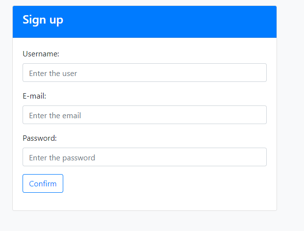
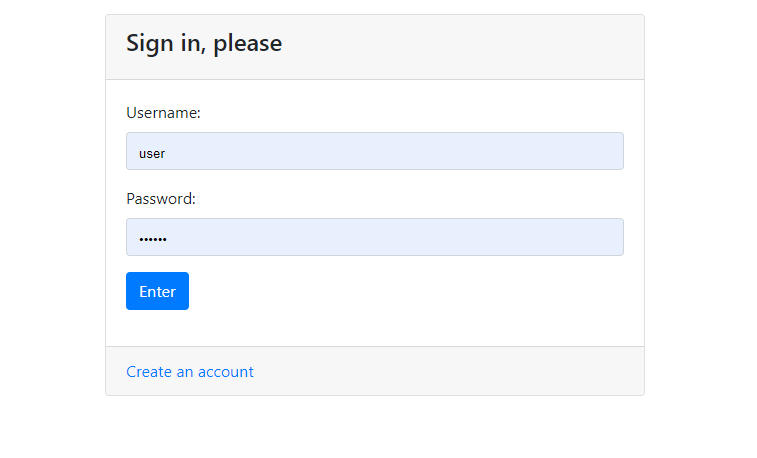

# job4j_forum

### Описание
Простейший форум, реализованный для изучения технологий,
перечисленных в следующем разделе. Данный форум позволяет добавлять 
посты, отвечать на них. Также содержит регистрацию пользователей и
авторизацию.

### Технологии
- Java 
   - Spring Security
   - Spring Boot
   - Spring MVC
   - Spring Data
   - Java 12
- Hibernate
- PostgreSQL 10
- JSP
- JSTL
- CSS (Bootstrap 4.6)
- maven
- IntelliJ IDEA 19.3

### Функциональность
Регистрация на форуме.

Авторизация для входа на форум.

Создание новой темы.

Главная страница по списком всех тем.

Ответы на тему.

